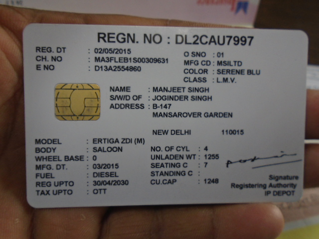
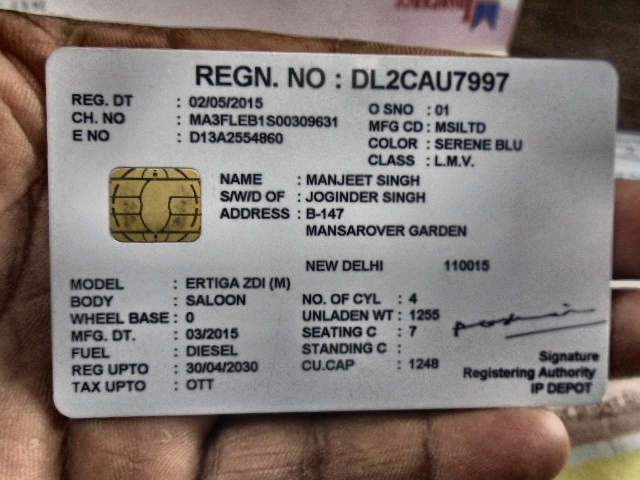

# Text Detection on a Registration Certificate

A registration certificate or RC is an official document stating that your vehicle is registered with the Indian government. I've used [AWS Rekognition](https://aws.amazon.com/rekognition/) to detect text after performing some preprocessing steps.

The task is to recognize the following fields from a picture of a  RC.
- License plate number or Regn number
- VIN number or Chassis number (typically 17 digit long)
- Name
- Engine number
- Registration date
- Mfg. date


### Unprocessed and Processed Picture

  

### Output

```python
{'license_plate': 'DL2CAU7997',
 'reg_date': '02/05/2015',
 'chass_num': 'MA3FLEB1S00309631',
 'eng_num': 'D13A2554860',
 'name': 'MANJEET SINGH'}
```

---
[```pre_process.py```](pre_process.py) contains the script to process images where I first convert the image into LAB color space and then apply the **Contrast Limited Adaptive Histogram Equalization (CLAHE)** method on it.

The LAB color space goes about defining colors differently. Whereas RGB defines color by a combination of red, green, and blue values of different shades, LAB uses three different channels. They are: Lightness, something called the A Channel, and the B Channel. Hence, Lightness, A Channel, and B Channel are shortened to L-A-B, LAB.

Adaptive histogram equalization (AHE) is a computer image processing technique used to improve contrast in images. It differs from ordinary histogram equalization in the respect that the adaptive method computes several histograms, each corresponding to a distinct section of the image, and uses them to redistribute the lightness values of the image. It is therefore suitable for improving the local contrast and enhancing the definitions of edges in each region of an image.

However, **AHE has a tendency to overamplify noise** in relatively homogeneous regions of an image. A variant of adaptive histogram equalization called contrast limited adaptive histogram equalization **(CLAHE) prevents this by limiting the amplification**.

These images are then uploaded to AWS.

```bash
aws lambda invoke --function-name "mynewtext" --log-type Tail --payload file://~Downloads/RC/data.json ~/Downloads/RC/output.json
```

[```Get Details.ipynb```](Get%20Details.ipynb) uses **Regex** to extract the required fields from the JSON file and store them in a dictionary as a key-value pair


